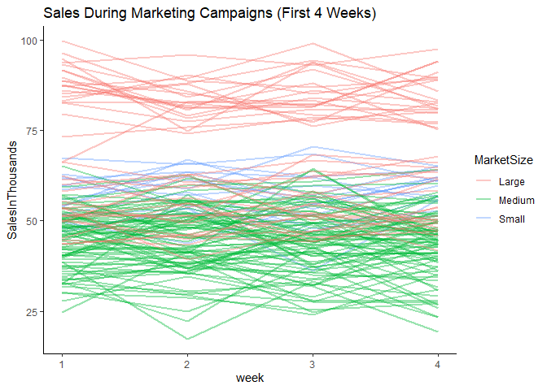
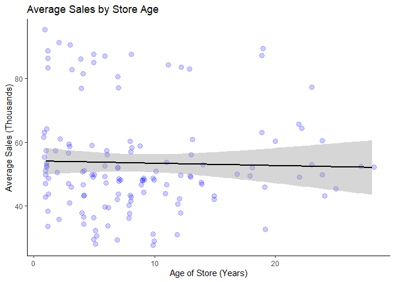
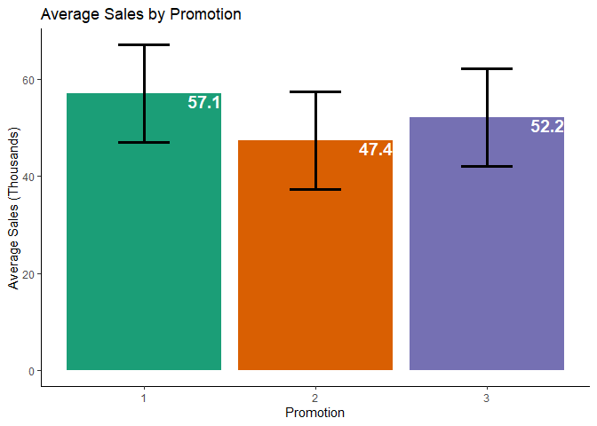

a_b_test
================
Andrew Cotter
2023-10-24

# A/B Testing Analysis Using an Example Data Set

## Introduction

### Scenario

A fast-food chain plans to add a new item to its menu. However, they are
still undecided between three possible promotion campaigns for promoting
the new product. In order to determine which promotion has the greatest
effect on sales, the new item is introduced at locations in several
randomly selected markets. A different promotion is used at each
location, and the weekly sales of the new item are recorded for the
first four weeks.

### Goal

Evaluate A/B testing results and decide which promotion strategy works
the best.

### Columns

- **MarketID**: unique identifier for market
- **MarketSize**: size of market area by sales
- **LocationID**: unique identifier for store location
- **AgeOfStore**: age of store in years Promotion: one of three
  promotions that were tested
- **week**: one of four weeks when the promotions were run
- **SalesInThousands**: sales amount for a specific LocationID,
  Promotion, and week

Data was sourced from
[Kaggle](https://www.kaggle.com/datasets/chebotinaa/fast-food-promotion-campaign-ab-test)

------------------------------------------------------------------------

## Data Loading and Inspection

``` r
library(readxl)
d = read.csv("WA_Marketing-Campaign.csv")
head(d)
```

    ##   MarketID MarketSize LocationID AgeOfStore Promotion week SalesInThousands
    ## 1        1     Medium          1          4         3    1            33.73
    ## 2        1     Medium          1          4         3    2            35.67
    ## 3        1     Medium          1          4         3    3            29.03
    ## 4        1     Medium          1          4         3    4            39.25
    ## 5        1     Medium          2          5         2    1            27.81
    ## 6        1     Medium          2          5         2    2            34.67

Upon inspection, I notice that there are a few columns that need
redefining in terms of their data type. MarketID, LocationID, and
Promotion should all be factors rather than integers.

``` r
d$MarketID = as.factor(d$MarketID)
d$LocationID = as.factor(d$LocationID)
d$Promotion = as.factor(d$Promotion)

print(summary(d))
```

    ##     MarketID    MarketSize          LocationID    AgeOfStore     Promotion
    ##  3      : 88   Length:548         1      :  4   Min.   : 1.000   1:172    
    ##  10     : 80   Class :character   2      :  4   1st Qu.: 4.000   2:188    
    ##  5      : 60   Mode  :character   3      :  4   Median : 7.000   3:188    
    ##  6      : 60                      4      :  4   Mean   : 8.504            
    ##  7      : 60                      5      :  4   3rd Qu.:12.000            
    ##  1      : 52                      6      :  4   Max.   :28.000            
    ##  (Other):148                      (Other):524                             
    ##       week      SalesInThousands
    ##  Min.   :1.00   Min.   :17.34   
    ##  1st Qu.:1.75   1st Qu.:42.55   
    ##  Median :2.50   Median :50.20   
    ##  Mean   :2.50   Mean   :53.47   
    ##  3rd Qu.:3.25   3rd Qu.:60.48   
    ##  Max.   :4.00   Max.   :99.65   
    ## 

``` r
print(range(table(d$MarketID)))
```

    ## [1] 24 88

It appears that there are some imbalances in the data set.

- For MarketID, there are a variety of different counts that range from
  24-88. The number of observations that we have per market is going to
  influence the degree of confidence in the conclusions that we can draw
  within that market.
- In terms of market sizes, it appears that medium markets are by far
  the most common. Again, we are going to have less confidence in the
  conclusions that we draw about large and especially small markets
  compared to the ones we draw about medium markets.
- Finally, it appears that promotion 1 was shown slightly less than
  promotions 2 and 3.

``` r
table(is.na(d))
```

    ## 
    ## FALSE 
    ##  3836

There are no missing values.

------------------------------------------------------------------------

## Searching for Confounds

Before we go about building a model for our variable of interest
(Promotion), we need to do some checks to ensure that there are no
*confounds* that were introduced by the experimental design.

A *confound* is any variable, whether it is in the data set or not, that
impacts both the treatment and the outcome. This commonly arises from
poor experimental design, such as imbalances in the characteristics of
the control and treatment groups.

### Market Size

First, we will investigate market size. To reiterate, we need to
establish that market size is a good predictor of both the outcome and
the treatment in order to conclude that it is a confound. Starting with
its impact on the outcome:

``` r
library(dplyr)

d %>%
  group_by(MarketSize) %>%
  summarise(avg_sales = mean(SalesInThousands))
```

    ## # A tibble: 3 × 2
    ##   MarketSize avg_sales
    ##   <chr>          <dbl>
    ## 1 Large           70.1
    ## 2 Medium          44.0
    ## 3 Small           57.4

``` r
(summary(aov(SalesInThousands~MarketSize, d)))
```

    ##              Df Sum Sq Mean Sq F value Pr(>F)    
    ## MarketSize    2  76273   38136   268.9 <2e-16 ***
    ## Residuals   545  77290     142                   
    ## ---
    ## Signif. codes:  0 '***' 0.001 '**' 0.01 '*' 0.05 '.' 0.1 ' ' 1

The data is suggesting that the market size has an appreciable impact on
sales. The 1-way ANOVA suggests statistical significance, and the
summary table shows that large markets see, on average, about 60% more
in sales when compared to medium markets.

Next, we need to establish that promotion campaigns are unequally
distributed across the different market sizes in order to deem market
size a confound. Since we have such differences in the number of
observations per market, I will use a proportion table to produce the
point estimates, and I will use the chi-square test to check for
equality across the different cells of the table (of counts).

``` r
#Proportion table for percentage of market sizes per promotion type
round(
  prop.table(
    table(d$Promotion, d$MarketSize),
    margin = 1),
  2
)
```

    ##    
    ##     Large Medium Small
    ##   1  0.33   0.56  0.12
    ##   2  0.34   0.57  0.09
    ##   3  0.26   0.62  0.13

``` r
#Chi-Square test for equality of observations per cell
chisq.test(table(d$Promotion, d$MarketSize))
```

    ## 
    ##  Pearson's Chi-squared test
    ## 
    ## data:  table(d$Promotion, d$MarketSize)
    ## X-squared = 4.7539, df = 4, p-value = 0.3135

Based on this analysis, I will not worry too much about market size
being a confound. The distribution of promotions is balanced enough
across the different markets, based on the insignificance of the
chi-square value.

### Store Age

Next, in our further exploration of possible confounds, we can check to
see if the age of the store has an impact on sales. A simple scatter
plot and correlation metric will suffice here.

``` r
library(ggplot2)
#Average for each store across the 4 weeks
d %>% group_by(LocationID) %>%
  summarise(AgeOfStore = mean(AgeOfStore), Avg_Sales = mean(SalesInThousands)) %>%
#Plot
ggplot(aes(x = AgeOfStore, y = Avg_Sales))+
  geom_jitter(width = 0.2, alpha = 0.2, color = "blue", size = 3)+
  theme_classic()+
  geom_smooth(method = "lm", color = "black")+
  ggtitle("Average Sales by Store Age")+
  xlab("Age of Store (Years)")+ylab("Average Sales (Thousands)")
```

<!-- -->

``` r
cor.test(d$AgeOfStore, d$SalesInThousands)
```

    ## 
    ##  Pearson's product-moment correlation
    ## 
    ## data:  d$AgeOfStore and d$SalesInThousands
    ## t = -0.66699, df = 546, p-value = 0.5051
    ## alternative hypothesis: true correlation is not equal to 0
    ## 95 percent confidence interval:
    ##  -0.11202409  0.05535835
    ## sample estimates:
    ##         cor 
    ## -0.02853288

It doesn’t appear that the age of the store has a significant impact on
sales.

### Time

Getting into our first look at the efficacy of the promotion campaigns,
let’s visualize how the store sales change over the course of the 4
weeks that were measured. One would assume that a successful promotion
campaign would show increased sales as time goes on. However, there are
plenty of market forces outside of our control that could impact these
numbers at large.

``` r
ggplot(d, aes(x = week, y = SalesInThousands, group = LocationID, color = MarketSize))+
  geom_line(alpha = 0.4, size = 1)+
  theme_classic()+
  ggtitle("Sales During promotion Campaigns (First 4 Weeks)")
```

<!-- -->

There is a lot going on here, and it is tough to parse out any trend
over time, likely meaning that any effect is going to be relatively
small and potentially insignificant. I decided to color the lines by
market size, as they further illustrate that:

- Large markets tend to have much higher sales numbers than small and
  medium markets.
- Medium markets far outnumber both small and large markets in this data
  set.

I will employ a slightly different approach to investigate whether sales
are increasing over time.

``` r
library(reshape2)
#Reshape to 1 row per LocationID, weeks as columns, sales as cell values
dcast = dcast(d, LocationID~week, value.var = "SalesInThousands")
#Create a new column that represents the difference in sales between weeks 1 and 4
dcast$diff = dcast[,5]-dcast[,2]

#Density plot of differences
ggplot(dcast, aes(diff))+
  geom_density(color = "blue", size = 1, fill = "blue", alpha = 0.5, bw = 1)+
  geom_histogram(aes(y = ..density..), fill = "black", alpha = 0.3)+
  theme_classic()+
  geom_vline(aes(xintercept = median(dcast$diff)), size = 1.2)+
  xlab("Difference in Individual Location Earnings (Week 4 - Week 1)")
```

<!-- -->

There doesn’t seem to be much of a noteworthy trend here, either. If
anything, this distribution is slightly skewed to suggest fewer sales in
Week 4. As one final test, we can write a regression model to check this
conclusion.

For this model, I will be predicting sales as a function of week. I will
be including random intercepts for each LocationID, since the locations
represent a small sample of a larger population. Additionally, locations
are nested within markets, which are also random, so I will specify that
in the model as well. I would ideally like to do random slopes for
locations in addition to random intercepts, however I was given warnings
about the model being overfit when I tried that.

``` r
library(lme4)
summary(lmer(SalesInThousands~week+(1|MarketID/LocationID), d))
```

    ## Linear mixed model fit by REML ['lmerMod']
    ## Formula: SalesInThousands ~ week + (1 | MarketID/LocationID)
    ##    Data: d
    ## 
    ## REML criterion at convergence: 3561.4
    ## 
    ## Scaled residuals: 
    ##      Min       1Q   Median       3Q      Max 
    ## -2.66878 -0.60766  0.02688  0.65667  2.79161 
    ## 
    ## Random effects:
    ##  Groups              Name        Variance Std.Dev.
    ##  LocationID:MarketID (Intercept)  15.97    3.996  
    ##  MarketID            (Intercept) 198.84   14.101  
    ##  Residual                         26.52    5.150  
    ## Number of obs: 548, groups:  LocationID:MarketID, 137; MarketID, 10
    ## 
    ## Fixed effects:
    ##             Estimate Std. Error t value
    ## (Intercept)  52.5821     4.5071  11.667
    ## week         -0.1645     0.1968  -0.836
    ## 
    ## Correlation of Fixed Effects:
    ##      (Intr)
    ## week -0.109

Looking at the summary statistics of this model, week is given a very
small negative coefficient with a relatively large standard error. This
means that week has a small, insignificant impact on sales. We won’t
need to worry about it much when assessing the impact of the promotion
campaigns

## Analysis of Promotion Campaign

To analyze the impacts of the promotion campaigns, I will use a very
similar linear model to the one I used above to investigate the effects
of week. The only difference here is that we are replacing *week*, a
continuous predictor, with *Promotion*, which is categorical. All other
aspects of the model with regards to random effects and nesting will
stay the same.

``` r
model = lmer(SalesInThousands~Promotion + (1|MarketID/LocationID), d)
model_summary = summary(model)

library(lmerTest)
anova(model)
```

    ## Analysis of Variance Table
    ##           npar Sum Sq Mean Sq F value
    ## Promotion    2 8022.5  4011.2  151.35

``` r
library(emmeans)
model_output = emmeans(model, specs = pairwise~Promotion)
estimates = data.frame(model_output$emmeans)
ggplot(estimates, aes(x = Promotion, y = emmean, fill = Promotion, label = round(emmean,1)))+
  geom_bar(stat = "identity")+
  geom_errorbar(
    aes(ymin = lower.CL, ymax = upper.CL),
    width = 0.3,
    size = 1.3
    )+
  geom_text(size = 5, nudge_x = .35, nudge_y = -1.6, color = "white", fontface = "bold")+
  theme_classic()+
  scale_fill_brewer(palette = "Dark2")+
  ylab("Average Sales (Thousands)")+
  ggtitle("Average Sales by Promotion")+
  theme(legend.position = "None")
```

<!-- -->

``` r
model_output
```

    ## $emmeans
    ##  Promotion emmean   SE   df lower.CL upper.CL
    ##  1           57.1 4.44 9.12     47.1     67.1
    ##  2           47.4 4.44 9.12     37.3     57.4
    ##  3           52.2 4.44 9.10     42.1     62.2
    ## 
    ## Degrees-of-freedom method: satterthwaite 
    ## Confidence level used: 0.95 
    ## 
    ## $contrasts
    ##  contrast                estimate    SE  df t.ratio p.value
    ##  Promotion1 - Promotion2     9.72 0.559 125  17.397  <.0001
    ##  Promotion1 - Promotion3     4.92 0.568 125   8.662  <.0001
    ##  Promotion2 - Promotion3    -4.80 0.570 125  -8.422  <.0001
    ## 
    ## Degrees-of-freedom method: satterthwaite 
    ## P value adjustment: tukey method for comparing a family of 3 estimates
