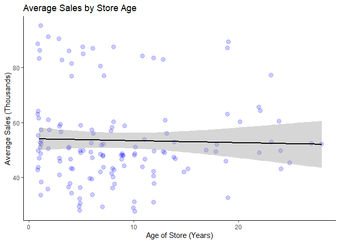

a_b_test
================
Andrew Cotter
2023-10-24

# A/B Testing Analysis Using an Example Data Set

## Introduction

### Scenario

A fast-food chain plans to add a new item to its menu. However, they are
still undecided between three possible marketing campaigns for promoting
the new product. In order to determine which promotion has the greatest
effect on sales, the new item is introduced at locations in several
randomly selected markets. A different promotion is used at each
location, and the weekly sales of the new item are recorded for the
first four weeks.

### Goal

Evaluate A/B testing results and decide which marketing strategy works
the best.

### Columns

- **MarketID**: unique identifier for market
- **MarketSize**: size of market area by sales
- **LocationID**: unique identifier for store location
- **AgeOfStore**: age of store in years Promotion: one of three
  promotions that were tested
- **week**: one of four weeks when the promotions were run
- **SalesInThousands**: sales amount for a specific LocationID,
  Promotion, and week

Data was sourced from
[Kaggle](https://www.kaggle.com/datasets/chebotinaa/fast-food-marketing-campaign-ab-test)

------------------------------------------------------------------------

## Data Loading and Inspection

``` r
library(readxl)
d = read.csv("WA_Marketing-Campaign.csv")
head(d)
```

    ##   MarketID MarketSize LocationID AgeOfStore Promotion week SalesInThousands
    ## 1        1     Medium          1          4         3    1            33.73
    ## 2        1     Medium          1          4         3    2            35.67
    ## 3        1     Medium          1          4         3    3            29.03
    ## 4        1     Medium          1          4         3    4            39.25
    ## 5        1     Medium          2          5         2    1            27.81
    ## 6        1     Medium          2          5         2    2            34.67

Upon inspection, I notice that there are a few columns that need
redefining in terms of their data type. MarketID, LocationID, and
Promotion should all be factors rather than integers.

``` r
d$MarketID = as.factor(d$MarketID)
d$LocationID = as.factor(d$LocationID)
d$Promotion = as.factor(d$Promotion)

print(summary(d))
```

    ##     MarketID    MarketSize    LocationID    AgeOfStore     Promotion
    ##  3      : 88   Large :168   1      :  4   Min.   : 1.000   1:172    
    ##  10     : 80   Medium:320   2      :  4   1st Qu.: 4.000   2:188    
    ##  5      : 60   Small : 60   3      :  4   Median : 7.000   3:188    
    ##  6      : 60                4      :  4   Mean   : 8.504            
    ##  7      : 60                5      :  4   3rd Qu.:12.000            
    ##  1      : 52                6      :  4   Max.   :28.000            
    ##  (Other):148                (Other):524                             
    ##       week      SalesInThousands
    ##  Min.   :1.00   Min.   :17.34   
    ##  1st Qu.:1.75   1st Qu.:42.55   
    ##  Median :2.50   Median :50.20   
    ##  Mean   :2.50   Mean   :53.47   
    ##  3rd Qu.:3.25   3rd Qu.:60.48   
    ##  Max.   :4.00   Max.   :99.65   
    ## 

``` r
print(range(table(d$MarketID)))
```

    ## [1] 24 88

It appears that there are some imbalances in the data set.

- For MarketID, there are a variety of different counts that range from
  24-88. The number of observations that we have per market is going to
  influence the degree of confidence in the conclusions that we can draw
  within that market.
- In terms of market sizes, it appears that medium markets are by far
  the most common. Again, we are going to have less confidence in the
  conclusions that we draw about large and especially small markets
  compared to the ones we draw about medium markets.
- Finally, it appears that promotion 1 was shown slightly less than
  promotions 2 and 3.

``` r
table(is.na(d))
```

    ## 
    ## FALSE 
    ##  3836

There are no missing values.

------------------------------------------------------------------------

## Searching for Confounds

Before we go about building a model for our variable of interest
(Promotion), we need to do some checks to ensure that there are no
*confounds* that were introduced by the experimental design.

A *confound* is any variable, whether it is in the data set or not, that
impacts both the treatment and the outcome. This commonly arises from
poor experimental design, such as imbalances in the characteristics of
the control and treatment groups.

### Market Size

First, we will investigate market size. To reiterate, we need to
establish that market size is a good predictor of both the outcome and
the treatment in order to conclude that it is a confound. Starting with
its impact on the outcome:

``` r
library(dplyr)

d %>%
  group_by(MarketSize) %>%
  summarise(avg_sales = mean(SalesInThousands))
```

    ## # A tibble: 3 x 2
    ##   MarketSize avg_sales
    ##   <fct>          <dbl>
    ## 1 Large           70.1
    ## 2 Medium          44.0
    ## 3 Small           57.4

``` r
(summary(aov(SalesInThousands~MarketSize, d)))
```

    ##              Df Sum Sq Mean Sq F value Pr(>F)    
    ## MarketSize    2  76273   38136   268.9 <2e-16 ***
    ## Residuals   545  77290     142                   
    ## ---
    ## Signif. codes:  0 '***' 0.001 '**' 0.01 '*' 0.05 '.' 0.1 ' ' 1

The data is suggesting that the market size has an appreciable impact on
sales. The 1-way ANOVA suggests statistical significance, and the
summary table shows that large markets see, on average, about 60% more
in sales when compared to medium markets.

Next, we need to establish that promotion campaigns are unequally
distributed across the different market sizes in order to deem market
size a confound. Since we have such differences in the number of
observations per market, I will use a proportion table to produce the
point estimates, and I will use the chi-square test to check for
equality across the different cells of the table (of counts).

``` r
#Proportion table for percentage of market sizes per promotion type
round(
  prop.table(
    table(d$Promotion, d$MarketSize),
    margin = 1),
  2
)
```

    ##    
    ##     Large Medium Small
    ##   1  0.33   0.56  0.12
    ##   2  0.34   0.57  0.09
    ##   3  0.26   0.62  0.13

``` r
#Chi-Square test for equality of observations per cell
chisq.test(table(d$Promotion, d$MarketSize))
```

    ## 
    ##  Pearson's Chi-squared test
    ## 
    ## data:  table(d$Promotion, d$MarketSize)
    ## X-squared = 4.7539, df = 4, p-value = 0.3135

Based on this analysis, I will not worry too much about market size
being a confound. The distribution of promotions is balanced enough
across the different markets, based on the insignificance of the
chi-squre value.

Next, in our further exploration of possible confounds, we can check to
see if the age of the store has an impact on sales.

``` r
library(ggplot2)
ggplot(d, aes(x = AgeOfStore, y = SalesInThousands))+
  geom_jitter(width = 0.4, alpha = 0.2, color = "blue", size = 3)+
  theme_classic()
```

<!-- -->

``` r
cor.test(d$AgeOfStore, d$SalesInThousands)
```

    ## 
    ##  Pearson's product-moment correlation
    ## 
    ## data:  d$AgeOfStore and d$SalesInThousands
    ## t = -0.66699, df = 546, p-value = 0.5051
    ## alternative hypothesis: true correlation is not equal to 0
    ## 95 percent confidence interval:
    ##  -0.11202409  0.05535835
    ## sample estimates:
    ##         cor 
    ## -0.02853288
