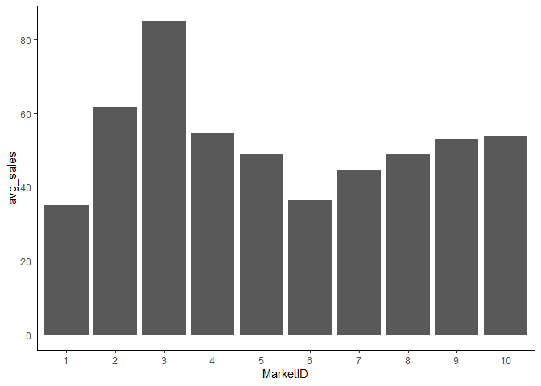

A/B Testing in R Markdown
================
Andrew Cotter
2023-10-25

## Introduction

### Scenario

A fast-food chain plans to add a new item to its menu. However, they are
still undecided between three possible promotion campaigns for promoting
the new product. In order to determine which promotion has the greatest
effect on sales, the new item is introduced at locations in several
randomly selected markets. A different promotion is used at each
location, and the weekly sales of the new item are recorded for the
first four weeks.

### Goal

Evaluate A/B testing results and decide which promotion strategy works
the best.

### Columns

- **MarketID**: unique identifier for market
- **MarketSize**: size of market area by sales
- **LocationID**: unique identifier for store location
- **AgeOfStore**: age of store in years
- **Promotion**: one of three promotions that were tested
- **week**: one of four weeks when the promotions were run
- **SalesInThousands**: sales amount for a specific LocationID,
  Promotion, and week

Data was sourced from
[Kaggle](https://www.kaggle.com/datasets/chebotinaa/fast-food-promotion-campaign-ab-test)

### Outcome

Employing a linear mixed-effect model, conditioned on Market ID and
Market Size, the findings indicate that Promotion \#1 emerges as the
most effective campaign for advancing. Projections suggest that this
campaign is poised to yield average sales outcomes ranging from 6% to
10% superior to the next most favorable alternative.

------------------------------------------------------------------------

## Data Loading and Inspection

``` r
library(readxl)
d = read.csv("WA_Marketing-Campaign.csv")
head(d)
```

    ##   MarketID MarketSize LocationID AgeOfStore Promotion week SalesInThousands
    ## 1        1     Medium          1          4         3    1            33.73
    ## 2        1     Medium          1          4         3    2            35.67
    ## 3        1     Medium          1          4         3    3            29.03
    ## 4        1     Medium          1          4         3    4            39.25
    ## 5        1     Medium          2          5         2    1            27.81
    ## 6        1     Medium          2          5         2    2            34.67

``` r
#Redefinee numerics as factors
d$MarketID = as.factor(d$MarketID)
d$LocationID = as.factor(d$LocationID)
d$Promotion = as.factor(d$Promotion)

#Column Summaries
print(summary(d))
```

    ##     MarketID    MarketSize          LocationID    AgeOfStore     Promotion
    ##  3      : 88   Length:548         1      :  4   Min.   : 1.000   1:172    
    ##  10     : 80   Class :character   2      :  4   1st Qu.: 4.000   2:188    
    ##  5      : 60   Mode  :character   3      :  4   Median : 7.000   3:188    
    ##  6      : 60                      4      :  4   Mean   : 8.504            
    ##  7      : 60                      5      :  4   3rd Qu.:12.000            
    ##  1      : 52                      6      :  4   Max.   :28.000            
    ##  (Other):148                      (Other):524                             
    ##       week      SalesInThousands
    ##  Min.   :1.00   Min.   :17.34   
    ##  1st Qu.:1.75   1st Qu.:42.55   
    ##  Median :2.50   Median :50.20   
    ##  Mean   :2.50   Mean   :53.47   
    ##  3rd Qu.:3.25   3rd Qu.:60.48   
    ##  Max.   :4.00   Max.   :99.65   
    ## 

``` r
#Missing value check
table(is.na(d))
```

    ## 
    ## FALSE 
    ##  3836

Upon inspection, adjustments were made to redefine the data types of
MarketID, LocationID, and Promotion as factors.

------------------------------------------------------------------------

## Searching for Confounds

The following sections explore the variables in the data set to assess
whether or not they are confounds that will need to be accounted for in
the final model.

A *confound* is any variable, whether it is in the data set or not, that
impacts the treatment and the outcome. This commonly arises from poor
experimental design, such as imbalances in the characteristics of the
control and treatment groups.

### Distribution of Promotions Across Markets

``` r
#Proportion table for percentage of promotions within each market
round(
  prop.table(
    table(d$MarketID, d$Promotion),
    margin = 1),
  2
)
```

    ##     
    ##         1    2    3
    ##   1  0.38 0.38 0.23
    ##   2  0.17 0.00 0.83
    ##   3  0.32 0.27 0.41
    ##   4  0.44 0.44 0.11
    ##   5  0.13 0.53 0.33
    ##   6  0.33 0.40 0.27
    ##   7  0.27 0.27 0.47
    ##   8  0.42 0.17 0.42
    ##   9  0.30 0.20 0.50
    ##   10 0.35 0.50 0.15

``` r
#Chi-square test for differences in promotion distribution across markets
chisq.test(table(d$MarketID, d$Promotion))
```

    ## 
    ##  Pearson's Chi-squared test
    ## 
    ## data:  table(d$MarketID, d$Promotion)
    ## X-squared = 85.916, df = 18, p-value = 7.749e-11

``` r
library(dplyr)
library(ggplot2)
#Average Sales per MarketID
d%>%
  group_by(MarketID)%>%
  summarise(avg_sales = mean(SalesInThousands)) %>%
  ggplot(aes(x = MarketID, y = avg_sales))+
    geom_bar(stat = "identity")+
    theme_classic()
```

<!-- -->

``` r
#ANOVA to test for significant differences in sales across MarketIDs
summary(aov(SalesInThousands~MarketID, d))
```

    ##              Df Sum Sq Mean Sq F value Pr(>F)    
    ## MarketID      9 131188   14576   350.5 <2e-16 ***
    ## Residuals   538  22375      42                   
    ## ---
    ## Signif. codes:  0 '***' 0.001 '**' 0.01 '*' 0.05 '.' 0.1 ' ' 1

*MarketID* is a confounding factor. The promotions are not equally
distributed across the different markets (as indicated by the
significant chi-square statistic), and the market has a significant
impact on sales (as indicated by the ANOVA).

### Market Size

NOTE: Each *MarketID*, which was already determined a confound, only has
a single market size value associated with it. If market size has a
significant impact on sales, it would explain some of why MarketID has
an impact on sales.

``` r
d %>%
  group_by(MarketSize) %>%
  summarise(avg_sales = mean(SalesInThousands))
```

    ## # A tibble: 3 × 2
    ##   MarketSize avg_sales
    ##   <chr>          <dbl>
    ## 1 Large           70.1
    ## 2 Medium          44.0
    ## 3 Small           57.4

``` r
summary(aov(SalesInThousands~MarketSize, d))
```

    ##              Df Sum Sq Mean Sq F value Pr(>F)    
    ## MarketSize    2  76273   38136   268.9 <2e-16 ***
    ## Residuals   545  77290     142                   
    ## ---
    ## Signif. codes:  0 '***' 0.001 '**' 0.01 '*' 0.05 '.' 0.1 ' ' 1

``` r
#Proportion table for percentage of market sizes per promotion type
round(
  prop.table(
    table(d$Promotion, d$MarketSize),
    margin = 1),
  2
)
```

    ##    
    ##     Large Medium Small
    ##   1  0.33   0.56  0.12
    ##   2  0.34   0.57  0.09
    ##   3  0.26   0.62  0.13

``` r
#Chi-Square test for equality of observations per cell
chisq.test(table(d$Promotion, d$MarketSize))
```

    ## 
    ##  Pearson's Chi-squared test
    ## 
    ## data:  table(d$Promotion, d$MarketSize)
    ## X-squared = 4.7539, df = 4, p-value = 0.3135

The 1-way ANOVA yielded statistical significance, and the summary table
shows that large markets see, on average, about 60% more in sales
compared to medium markets. However, it cannot be concluded that the
promotions are differently distributed across the different market
sizes. Therefore, *MarketSize* is not a confound.

### Store Age

``` r
library(ggplot2)
#Average for each store across the 4 weeks
d %>% group_by(LocationID) %>%
  summarise(AgeOfStore = mean(AgeOfStore), Avg_Sales = mean(SalesInThousands)) %>%
#Plot
ggplot(aes(x = AgeOfStore, y = Avg_Sales))+
  geom_jitter(width = 0.2, alpha = 0.2, color = "blue", size = 3)+
  theme_classic()+
  geom_smooth(method = "lm", color = "black")+
  ggtitle("Average Sales by Store Age")+
  xlab("Age of Store (Years)")+ylab("Average Sales (Thousands)")
```

<!-- -->

``` r
cor.test(d$AgeOfStore, d$SalesInThousands)
```

    ## 
    ##  Pearson's product-moment correlation
    ## 
    ## data:  d$AgeOfStore and d$SalesInThousands
    ## t = -0.66699, df = 546, p-value = 0.5051
    ## alternative hypothesis: true correlation is not equal to 0
    ## 95 percent confidence interval:
    ##  -0.11202409  0.05535835
    ## sample estimates:
    ##         cor 
    ## -0.02853288

It doesn’t appear that the age of the store has a significant impact on
sales.

### Time

``` r
#Visualization of sales over the Promotional Trial.
ggplot(d, aes(x = week, y = SalesInThousands, group = LocationID, color = MarketSize))+
  geom_line(alpha = 0.4, size = 1)+
  theme_classic()+
  ggtitle("Sales During Promotion Campaigns (First 4 Weeks)")
```

<!-- -->

``` r
library(reshape2)
#Reshape to 1 row per LocationID, weeks as columns, sales as cell values
dcast = dcast(d, LocationID~week, value.var = "SalesInThousands")
#Create a new column that represents the difference in sales between weeks 1 and 4
dcast$diff = dcast[,5]-dcast[,2]

#Density plot of differences
ggplot(dcast, aes(diff))+
  geom_density(color = "blue", size = 1, fill = "blue", alpha = 0.5, bw = 1)+
  geom_histogram(aes(y = ..density..), fill = "black", alpha = 0.3)+
  theme_classic()+
  geom_vline(aes(xintercept = median(dcast$diff)), size = 1.2)+
  annotate(
    "text", 
    x = median(dcast$diff)-0.5, y = 0.065, 
    label = paste("median = ", median(dcast$diff)), 
    angle = 90, fontface = "bold")+
  xlab("Difference in Individual Location Sales (Week 4 - Week 1)")
```

<!-- -->

``` r
library(lme4)
summary(lmer(SalesInThousands~week+(1|MarketID/LocationID), d))
```

    ## Linear mixed model fit by REML ['lmerMod']
    ## Formula: SalesInThousands ~ week + (1 | MarketID/LocationID)
    ##    Data: d
    ## 
    ## REML criterion at convergence: 3561.4
    ## 
    ## Scaled residuals: 
    ##      Min       1Q   Median       3Q      Max 
    ## -2.66878 -0.60766  0.02688  0.65667  2.79161 
    ## 
    ## Random effects:
    ##  Groups              Name        Variance Std.Dev.
    ##  LocationID:MarketID (Intercept)  15.97    3.996  
    ##  MarketID            (Intercept) 198.84   14.101  
    ##  Residual                         26.52    5.150  
    ## Number of obs: 548, groups:  LocationID:MarketID, 137; MarketID, 10
    ## 
    ## Fixed effects:
    ##             Estimate Std. Error t value
    ## (Intercept)  52.5821     4.5071  11.667
    ## week         -0.1645     0.1968  -0.836
    ## 
    ## Correlation of Fixed Effects:
    ##      (Intr)
    ## week -0.109

All of the visualizations and analysis techniques attempted above
suggest no clear trend in sales over the four weeks.

## Analysis of Promotion Campaign

It has been established that *MarketID* impacts both *MarketSize* and
average sales, and that the *Promotions* are not equally distributed
across the different markets. The casual structure is visualized in the
directed acyclic graph (DAG) below:

<!-- -->

The final model is going to need to be conditioned on the treatment
(*Promotion*) and the outcome (*SalesInThousands*). However, this
variable set alone leaves a backdoor path from promotion to sales via
the route that goes through *MarketID* and *MarketSize*.

Additionally, *MarketSize* affects sales independent of *Promotion*.
Conditioning the model on *MarketSize* will take care of both of these
concerns - it will isolate the effect of *Promotion* by removing
variability in sales due to *MarketSize* while also closing the backdoor
path between *Promotion* and sales via *MarketID*. Finally, nested
random intercepts will also be included.

``` r
m1 = lmer(SalesInThousands ~ Promotion + MarketSize + (1|MarketID/LocationID), d)
```

``` r
library(emmeans)
#Extracting summary statistics and estimates from the model
model_output = emmeans(m1, specs = pairwise~Promotion)
estimates = data.frame(model_output$emmeans)

#Plotting model estimates
ggplot(estimates, aes(x = Promotion, y = emmean, fill = Promotion, label = round(emmean,1)))+
  geom_bar(stat = "identity")+
  geom_errorbar(
    aes(ymin = lower.CL, ymax = upper.CL),
    width = 0.3,
    size = 1.3
    )+
  geom_text(size = 5, nudge_x = .35, nudge_y = -1.6, color = "white", fontface = "bold")+
  theme_classic()+
  scale_fill_brewer(palette = "Dark2")+
  ylab("Average Sales (Thousands)")+
  ggtitle("Average Sales by Promotion")+
  theme(legend.position = "None")
```

<!-- -->

``` r
#Pairwise Comparisons
model_output$contrasts
```

    ##  contrast                estimate    SE  df t.ratio p.value
    ##  Promotion1 - Promotion2     9.72 0.559 125  17.402  <.0001
    ##  Promotion1 - Promotion3     4.91 0.568 125   8.643  <.0001
    ##  Promotion2 - Promotion3    -4.82 0.570 125  -8.447  <.0001
    ## 
    ## Results are averaged over the levels of: MarketSize 
    ## Degrees-of-freedom method: satterthwaite 
    ## P value adjustment: tukey method for comparing a family of 3 estimates

## Discussion

This model suggests that Promotion 1 is the superior campaign, followed
by Promotion 3 and then Promotion 2. All of the individual pairwise
comparisons were significantly different, indicating that each one
produces a distinctly different value in terms of average sales.

It may appear at first glance that the error bars on the graph and the
pairwise comparisons are not aligned in terms of their conclusions. The
degree of overlap in the error bars suggests a lack of statistical
significance, while the pairwise comparisons extracted from the model
all have very low p-values. In this case, however, these two metrics are
calculated differently and have distinct interpretations:

- The error bars communicate the degree of uncertainty we have about the
  sales yielded by each promotional campaign, in reference to the
  average across a population of markets. There were 10 markets in this
  experiment, and the assumption was made that these 10 markets
  represent a subset of a broader population of markets. Due to the
  inherent variability in sales that can be attributed to the markets,
  these estimates have a relatively high uncertainty associated with
  them.
- Considering the pairwise comparisons, it is worth remembering that,
  for the most part, each market saw each promotional campaign at least
  one time. Consequently, when it comes to comparing one campaign to
  another, the model is doing those comparisons *within each market*
  first. From there, the model is using that distribution within-market
  comparisons to assess the significance of the difference between two
  promotional campaigns. This gives the pairwise comparisons more
  statistical power because the model is able to control for the
  inter-market variability that is not controlled for in the estimated
  means.
